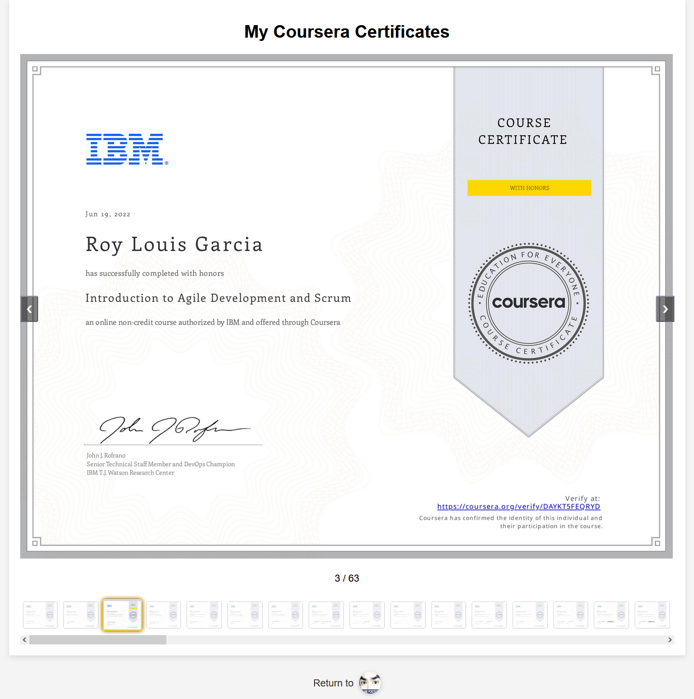

# 🎓 My Coursera Certificates Gallery

A dynamic, interactive web application showcasing my professional development journey through various online courses and certifications from top institutions including IBM, Google, Meta, Stanford, DeepLearning.AI, and more.



## 🌟 Overview

This project presents a comprehensive portfolio of my educational achievements in a visually appealing slideshow format. The application displays certificates from multiple domains including:

- **DevOps & Cloud Computing** - IBM Cloud, containerization, CI/CD
- **Cybersecurity** - Network security, penetration testing, incident response
- **Data Engineering & Analytics** - Database management, ETL pipelines, data warehousing
- **Machine Learning & AI** - Neural networks, supervised/unsupervised learning, NLP
- **Software Development** - Python, JavaScript, mobile app development
- **Web Development** - Frontend/backend development, React, databases

## ✨ Features

### Interactive Slideshow
- **Smooth Navigation**: Arrow controls and keyboard navigation for seamless browsing
- **Thumbnail Gallery**: Quick access to any certificate via thumbnail navigation
- **Slide Counter**: Real-time tracking of current position in the gallery
- **Responsive Design**: Optimized for all device sizes and screen resolutions

### Certificate Verification
- **Direct Links**: Each certificate image links to its official Coursera verification page
- **Hover Indicators**: Visual cues showing certificates are clickable and verifiable
- **Authentic Credentials**: All certificates link to legitimate Coursera accomplishment pages

### User Experience
- **Modern UI**: Clean, professional design with smooth animations
- **Portfolio Integration**: Direct navigation back to main portfolio
- **Fast Loading**: Optimized images and efficient code for quick page loads
- **Accessibility**: Keyboard navigation and screen reader friendly

## 🛠️ Technical Implementation

### Technologies Used
- **HTML5**: Semantic markup and modern web standards
- **CSS3**: Advanced styling with flexbox, animations, and responsive design
- **Vanilla JavaScript**: Dynamic content generation and interactive functionality
- **No External Dependencies**: Lightweight and fast-loading application

### Key Components
- **Dynamic Slide Generation**: JavaScript automatically creates slides from image array
- **Thumbnail Navigation**: Auto-generated thumbnail gallery with current slide highlighting
- **Modal Functionality**: Full-screen certificate viewing capability
- **Verification Integration**: Seamless linking to official certificate verification

## 📚 Certification Domains

### 🔧 DevOps & Cloud Technologies
- Introduction to DevOps, Cloud Computing, and Agile Development
- Containers, Docker, Kubernetes & OpenShift
- CI/CD, Application Security, and Microservices Architecture

### 🛡️ Cybersecurity
- Cybersecurity Tools & Cyber Attacks
- Network Security & OS Administration
- Penetration Testing, Threat Hunting & Cryptography
- Incident Response & Digital Forensics

### 📊 Data Science & Engineering
- Database Management & SQL
- Data Warehousing & ETL Pipelines
- Python for Data Science & Analytics
- Big Data Processing with Apache technologies

### 🤖 Machine Learning & AI
- Neural Networks & Deep Learning
- Natural Language Processing with Attention Models
- Supervised & Unsupervised Learning Algorithms
- Advanced Learning Algorithms & Reinforcement Learning

### 💻 Software Development
- Python, JavaScript, and Mobile App Development
- React, Frontend/Backend Development
- Version Control with Git & GitHub
- Test-Driven Development & Software Engineering

## 🚀 Getting Started

1. **Clone the repository**:
   ```bash
   git clone https://github.com/roylouisgarcia/courses.git
   ```

2. **Open the application**:
   - Simply open `index.html` in any modern web browser
   - No build process or dependencies required

3. **Navigate the gallery**:
   - Use arrow buttons or keyboard arrows to browse certificates
   - Click thumbnails for quick navigation
   - Click certificate images to verify authenticity on Coursera

## 🔗 Live Demo

Visit the live application: [Coursera Certificates Gallery](https://roylouisgarcia.github.io/courses/)

## 📱 Responsive Design

The application is fully responsive and provides an optimal viewing experience across:
- **Desktop**: Full-featured experience with all navigation options
- **Tablet**: Touch-friendly interface with swipe gestures
- **Mobile**: Optimized layout for small screens with easy navigation

## 🎯 Future Enhancements

- [ ] Swipe gesture support for mobile devices
- [ ] Certificate categorization and filtering
- [ ] Search functionality for specific courses
- [ ] Timeline view of learning journey
- [ ] Integration with LinkedIn Learning and other platforms

## 📄 License

This project is open source and available under the [MIT License](LICENSE).

## 📧 Contact

**Roy Louis Garcia**
- Portfolio: [roylouisgarcia.github.io/portfolio](https://roylouisgarcia.github.io/portfolio/)
- GitHub: [@roylouisgarcia](https://github.com/roylouisgarcia)

---

*This gallery represents my commitment to continuous learning and professional development in the ever-evolving field of technology.*
